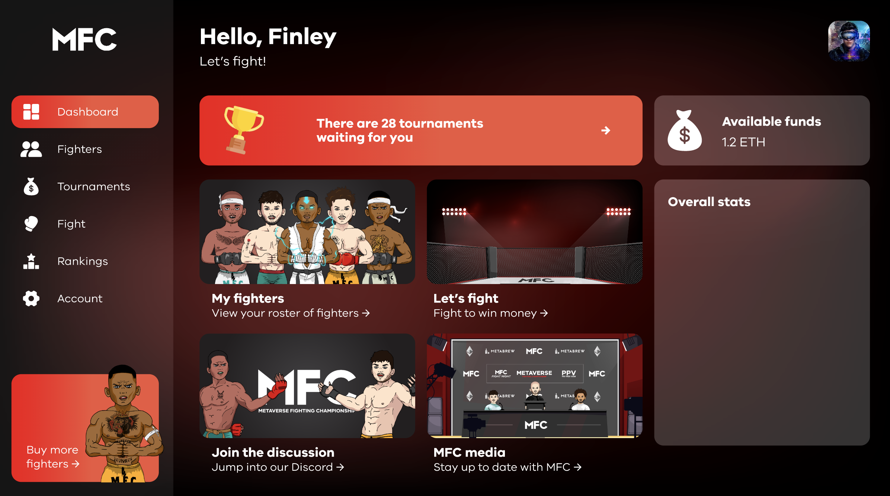
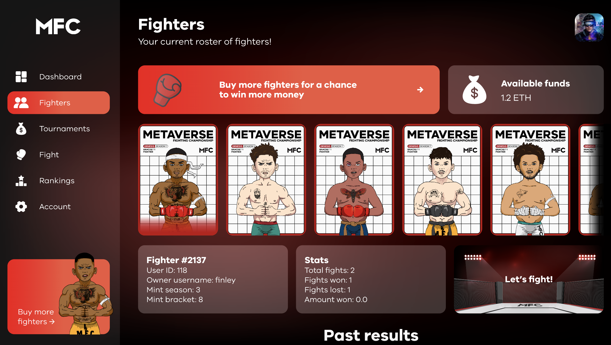
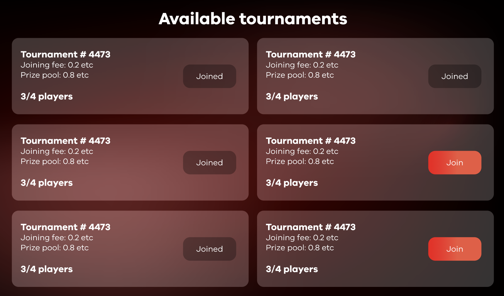
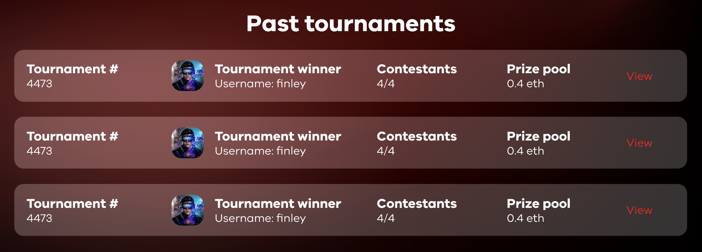
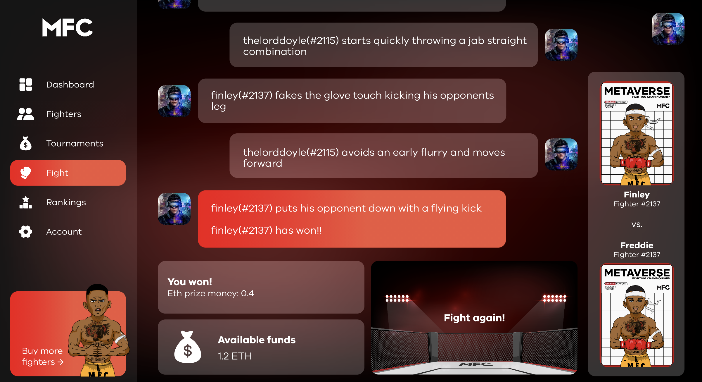
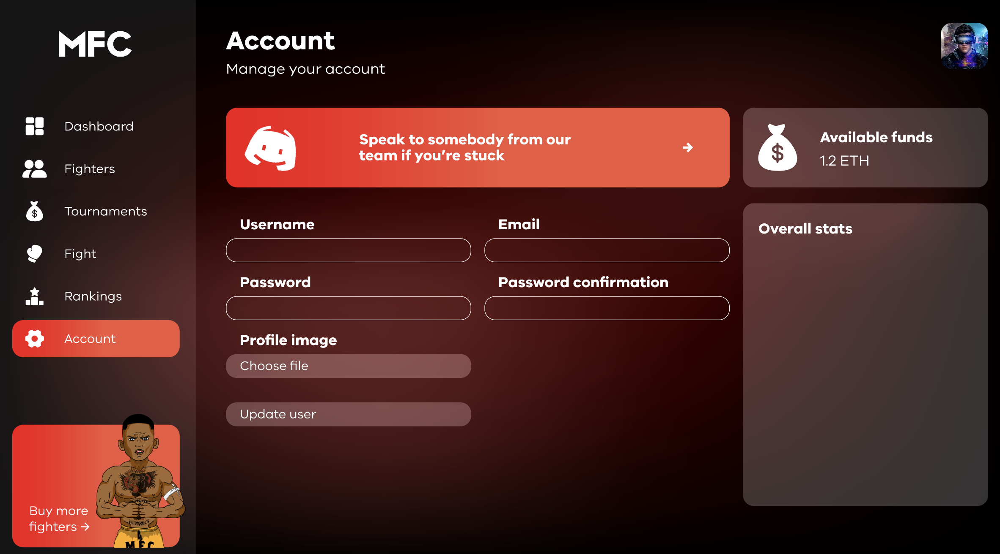

<h1 align="center">Metaverse Fighting Championship</h1>

  <a href="#about">About</a> •
  <a href="#installation">Installation</a> •
  <a href="#features">Features</a> •
  <a href="#wiki">Wiki</a> •
  <a href="#support">Support</a> •
  <a href="#credits">Credits</a> •
  <a href="#license">License</a>

## About
### Utility-driven, MMA-inspired NFT game.
The Metaverse Fighting Championship (MFC) is a blockchain game that allows participation through ownership of NFTs.

MFC will utilise the ownership of digital assets to participate in off-chain simulated MMA tournaments. Prize money will be rewarded to winners and runners up in the form of Ethereum airdrops on Polygon.

This front-end application is built with:
- JavaScript
- TypeScript
- React
- GraphQL
- XState
- HTML
- SCSS

To visit the app, please [click here.](https://metaverse-fc.netlify.app/)

To learn more, see the below <a href="#wiki">Wiki</a> section.

*Important note: This GitHub repo only represents the app's client side. You can view the [back-end repository here.](https://github.com/thelorddoyle/mfc-back-end)*

## Installation
Want to get a taste of being a part of the MFC? Here are some simple instructions on how to log in, mint a fighter register for your first tournament and view your past fights.

1. ### Log In / Register

To log in you will need to 'Connect Your Wallet'. You can do this by clicking on the 'Connect' button on the [homepage](https://metaverse-fc.netlify.app/).

Once there you can use our purpose-built test account.

| **Username** | **Password** |
|:------------:|:------------:|
|     test     |   password   |

Alternatively, feel free to register for your own account. 

2. ### View Your Profile

When you log in or register you will be able to visit your [profile](https://metaverse-fc.netlify.app/profile). This is the hub of your account and contains all of the relevant navigation links & information for you to interact with the MFC application.

Let's get you started! You can now buy or 'mint' your first fighter.

3. ### Mint Your First NFT

Minting generally means something is produced for the first time or made official, like minting a coin. In the crypto world, it has a similar meaning, but the process is a little different. 

Minting, in regards to NFTs, is the process of taking a digital asset and converting the digital file into a digital asset stored on the blockchain. Making it officially a commodity that can be bought and sold.

We use the word 'minting' because we are emulating this process in this build. It just means, 'purchase a character on the MFC game that is unique and belongs to you'.

You can click on [Mint](https://metaverse-fc.netlify.app/mint) in the header or on the homepage.

4. ### View Your Fighters

Once you have minted your first fighter, you will be able to see them in your 'Fighters' tab of your profile. Highlight a fighter - their stats, information and previous fights will appear on screen.

Their 'Past Results' are from the individual fights those fighters have had.

5. ### View Your Tournaments

Each tournament is made up of 32 fighters, each competing for the top spot. The winner & the runner-up win prizes. The tournament follows a standard single-elimination format. Round 1 will be 16 1v1 fights, the second round 8 1v1 fights, the Quarter Finals are 4 1v1 fights, the Semi-Finals are 2 1v1 fights. The final is made up of the two NFTs who have won all of these preceeding matches. They are competing for who wins 0.75 ETH and who will get the runner up prize of 0.25 ETH. 

Once you have minted your fighter, they are automatically added in to all scheduled tournaments they are eligible for. You can see your upcoming tournaments in the 'Tournaments' tab on your profile.

You can also see all of your previous tournaments that contain results.

From here you can view your individual tournaments and see how your NFT progressed.

[IMAGE OF A TOURNAMENT THAT HAS BEEN COMPLETED GOES HERE]

6. ### Watch a Fight

A 'fight' represents a truly randomised sequence of events (generated by an XState state machine purpose-built for MFC). The chance to win is exactly 50%, so each fight is effectively a randomised selection that is made more enjoyable through the text fight sequence.

You could land a knockout punch at the beginning of the match, even a flying knee! Or maybe you will grapple your opponent and choke them out after a long, gruelling battle. 

7. ### View the Fighter Rankings

You can view all of the fighters rankings in the 'Rankings' tab.

8. ### Edit Your Account

You can edit your account at any time with your in the 'Account' tab where you can add ETH, change your account details and review your current settings.

## Features

- Login & Register Users
- Change your account details
- Mint new NFTs
- Fights, tournaments & replays
- XState Game Engine

## Wiki

MFC is an NFT-game that is driven by the problems in the current PFP-led NFT marketplace. 

MFC looks to meet the demand for utility NFTs with play-to-earn features. 

By utilising gamification & prize money, this project represents a long-term and sustainable project with ongoing benefits for holders. Not through complex, hard-to-grasp tokenomics - instead with simple, obvious & automated participation and rewards. 

For all of the information on the game, how the tournaments work & how to get involved see our [Wiki here](https://metaverse-fighting-championship.gitbook.io/mfc/).
## Support

MFC is an open-source project and we welcome & encourage community contributions. 
## Credits

The three primary contributors are [thelorddoyle](https://github.com/thelorddoyle/), [Jesus-fhz](https://github.com/Jesus-fhz) and [impetusdev](https://github.com/impetusdev).

The total gallery of contributors can be seen below:

## Licence
We do not support the usage of our code for any other games or projects at this time. If you would like to discuss this, please contact us at [this email](emailhere).
