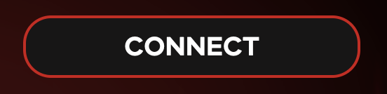

<h1 align="center">Metaverse Fighting Championship</h1>

  <a href="#about">About</a> •
  <a href="#installation">Installation</a> •
  <a href="#features">Features</a> •
  <a href="#wiki">Wiki</a> •
  <a href="#support">Support</a> •
  <a href="#credits">Credits</a> •
  <a href="#license">License</a>

## About
### Utility-driven, MMA-inspired NFT game.
The Metaverse Fighting Championship (MFC) is a blockchain game that allows participation through ownership of NFTs.

MFC will utilise the ownership of digital assets to participate in off-chain simulated MMA tournaments. Prize money will be rewarded to winners and runners up in the form of Ethereum airdrops on Polygon.

To visit the app, please [click here.](https://metaverse-fc.netlify.app/)

To learn more, see the below <a href="#wiki">Wiki</a> section.

*Important note: This GitHub repo only represents the app's client side. You can view the [back-end repository here.](https://github.com/thelorddoyle/mfc-back-end)*

## Installation
Want to get a taste of being a part of the MFC? Here are some simple instructions on how to log in, mint a fighter register for your first tournament and view your past fights.

1. ### Log In / Register

To log in you will need to 'Connect Your Wallet'. You can do this by clicking on the 'Connect' button on the [homepage](https://metaverse-fc.netlify.app/).

Once there you can use our purpose-built test account.

| Username    | Password    |
| ----------- | ----------- |
| test        | password    |

Alternatively, feel free to register for your own account. 

2. ### Mint Your First NFT

Minting generally means something is produced for the first time or made official, like minting a coin. In the crypto world, it has a similar meaning, but the process is a little different. 

Minting, in regards to NFTs, is the process of taking a digital asset and converting the digital file into a digital asset stored on the blockchain. Making it officially a commodity that can be bought and sold.

We use the word 'minting' because we are emulating this process in this build. It just means, 'purchase a character on the MFC game that is unique and belongs to you'.

You can click on [Mint](https://metaverse-fc.netlify.app/mint) in the header or on the homepage.

3. ### View Your Tournaments
4. ### Watch a Fight
5. ### Edit Your Account

## Features

## Wiki

MFC is an NFT-game that is driven by the problems in the current PFP-led NFT marketplace. 

MFC looks to meet the demand for utility NFTs with play-to-earn features. 

By utilising gamification & prize money, this project represents a long-term and sustainable project with ongoing benefits for holders. Not through complex, hard-to-grasp tokenomics - instead with simple, obvious & automated participation and rewards. 

For all of the information on the game, how the tournaments work & how to get involved see our [Wiki here](https://metaverse-fighting-championship.gitbook.io/mfc/).
## Support

MFC is an open-source project and we welcome & encourage community contributions. 
## Credits

The three primary contributors are [thelorddoyle](https://github.com/thelorddoyle/), [Jesus-fhz](https://github.com/Jesus-fhz) and [impetusdev](https://github.com/impetusdev).

The total gallery of contributors can be seen below:

## Licence
We do not support the usage of our code for any other games or projects at this time. If you would like to discuss this, please contact us at [this email](emailhere).
